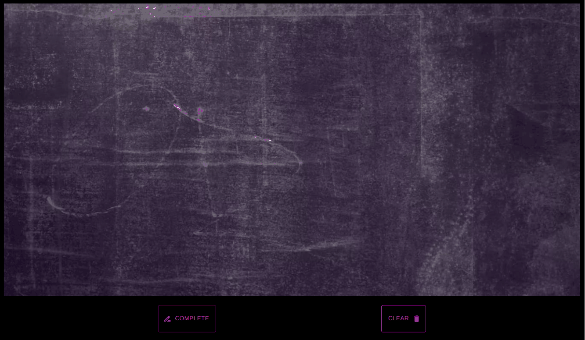

# Draw Polygon app

Proyecto creado con React

## En acción 

## Características

- Dos botones, uno para completar el polígono y otro para limpiar el lienzo.
- Cuando el usuario clickea sobre el lienzo, un vértice es añadido en esa posición y cada nuevo vértice es conectado con el anterior mediante una línea. 
- Cuando el usuario da click al botón de completar, el último vértice es conectado al primero, formando así un polígono. 
- Cunado el usuario da click al botón de clear, el lienzo se resetea. 

